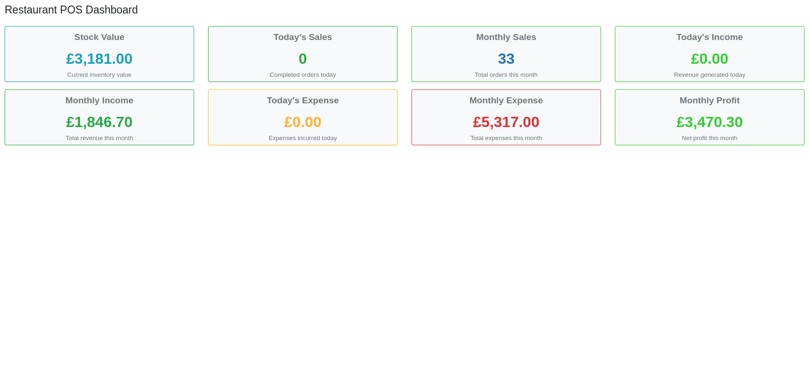
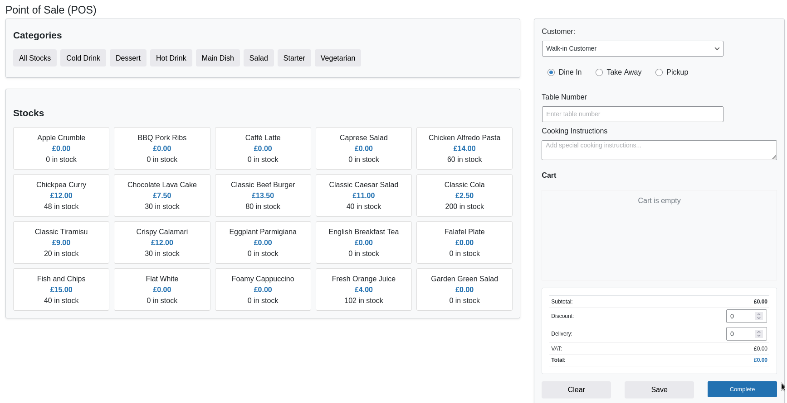
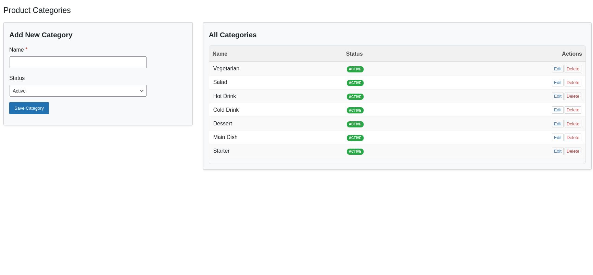
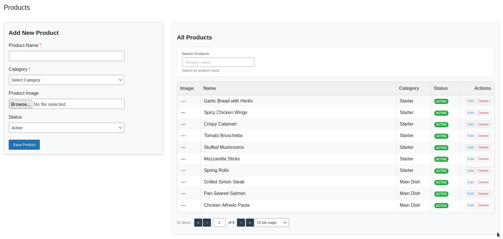
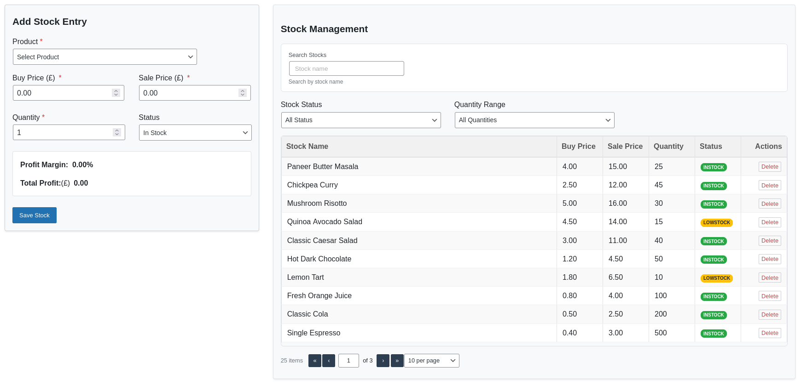
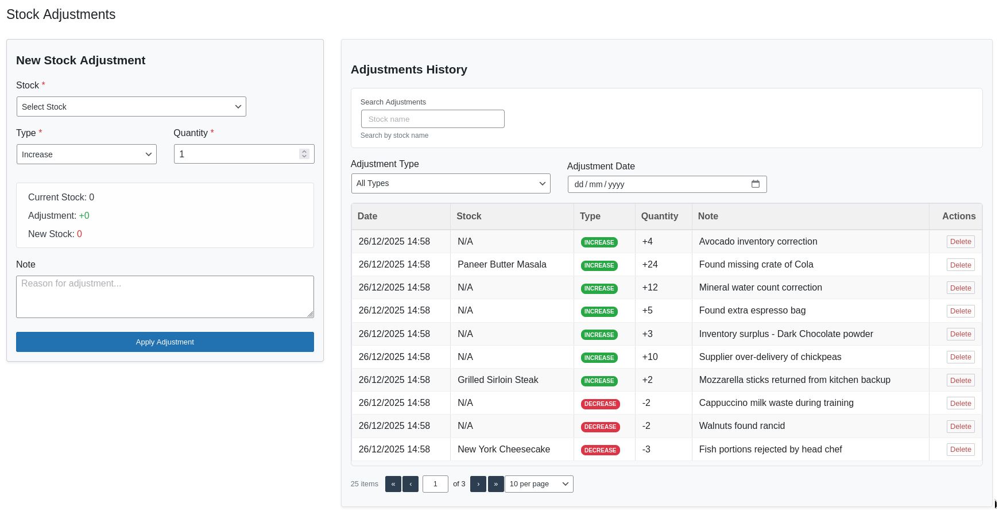
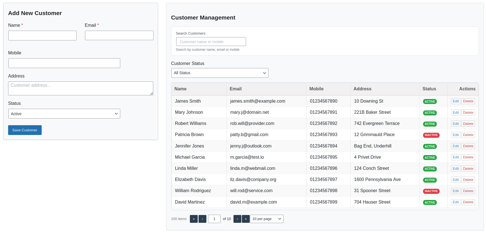
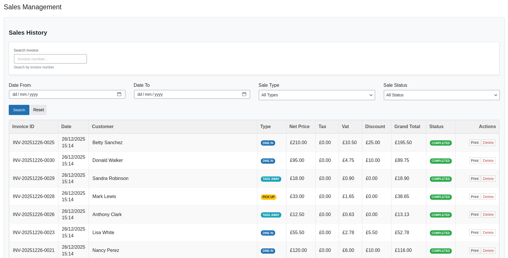
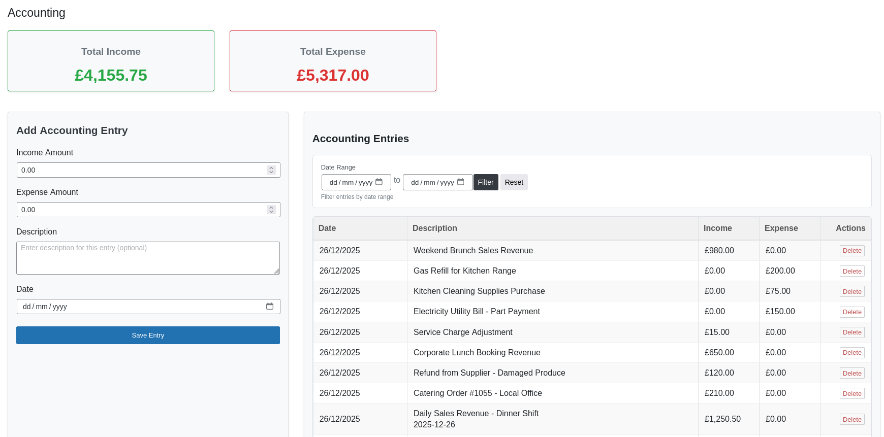
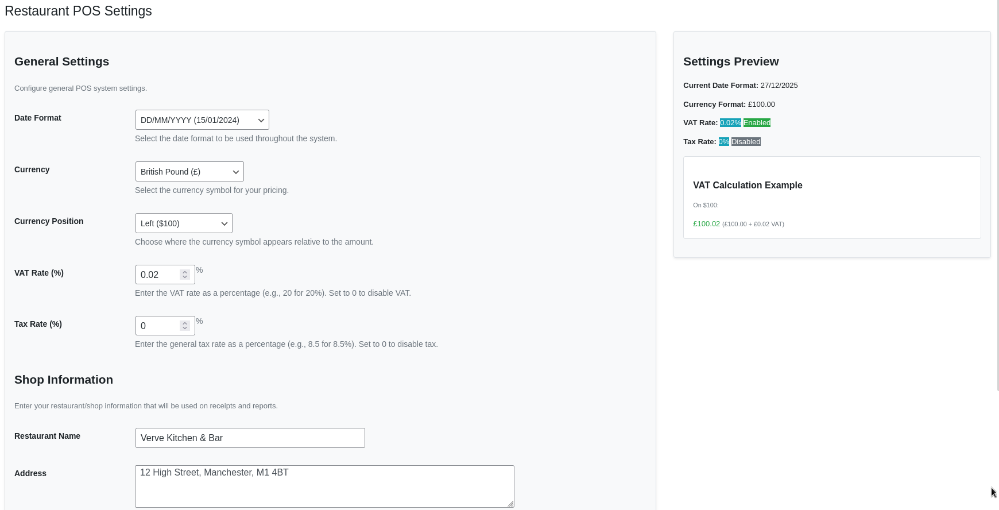

# Obydullah Restaurant POS Lite

A complete restaurant Point of Sale (POS) plugin for WordPress with inventory, order management, and sales tracking for food businesses.

---

## Description

**Obydullah Restaurant POS Lite** is a complete restaurant management solution that helps you streamline your restaurant operations. Manage your menu, process orders, track inventory, handle customers, and generate sales reports — all from your WordPress admin area.

## Video Tutorial

Watch the full tutorial and demo: [Video Tutorial](https://youtu.be/FlJ_RkWfsl0)

---

## Screenshots

### Dashboard Overview

### POS Interface

### Categories Management

### Product Management

### Stock Management

### Stock Adjustment

### Customer Management

### Sales History

### Accounting Module

### POS Settings

---

## Key Features

### Dashboard & Analytics

- Real-time overview of business metrics
- Today's vs Monthly sales comparison
- Stock value tracking
- Income and expense monitoring
- Profit calculation

### Inventory Management

- **Categories**: Organize products into categories with active/inactive status
- **Products**: Add/edit products with images, category assignment, and status tracking
- **Stock**: Track stock quantities, costs, and sale prices
- **Stock Adjustments**: Manual stock increase/decrease with validation

### Customer Management

- Complete customer database with contact details
- Status tracking (active/inactive)
- Customer statistics and filtering

### Point of Sale (POS) System

- Real-time product browsing by categories
- Multiple order types: **Dine-In**, **Take Away**, **Pickup**
- Cart management with quantity adjustment
- Real-time calculation (subtotal, discount, tax, VAT, delivery)
- Save sales for later completion
- Customer selection/creation

### Sales Management

- Complete sales history with filtering
- Invoice generation with customizable templates
- Print functionality
- Sales status tracking (saved/completed)

### Accounting Module

- Income and expense tracking
- Date-based filtering
- Financial summaries
- Manual accounting entries

### Settings & Configuration

- Shop information (name, address, phone)
- Currency settings (symbol, position)
- Tax and VAT configuration
- Date format customization

---

## Perfect For

- Restaurants and cafes
- Food trucks and stalls
- Coffee shops
- Bakeries and patisseries
- Pizza shops and takeaways
- Any food service business
- Small to medium-sized food establishments

---

## Requirements

- WordPress 5.0 or higher
- PHP 7.4 or higher (recommended PHP 8.0+)
- MySQL 5.6 or higher / MariaDB 10.0 or higher
- WordPress Administrator access for setup

---

## Installation

### Automatic Installation

1. Navigate to **Plugins > Add New** in your WordPress admin
2. Search for "Obydullah Restaurant POS Lite"
3. Click **Install Now**
4. Click **Activate**

### Manual Installation

1. Download the plugin ZIP file
2. Go to **Plugins > Add New** in your WordPress admin
3. Click **Upload Plugin** and select the ZIP file
4. Click **Install Now** and then **Activate**

### Setup

1. After activation, go to **Restaurant POS** in your WordPress admin menu
2. Start by configuring your shop settings in **Restaurant POS > Settings**
3. Add your product categories in **Restaurant POS > Categories**
4. Add your menu items in **Restaurant POS > Products**
5. Set up your initial stock in **Restaurant POS > Stocks**
6. You're ready to start taking orders in **Restaurant POS > POS**

---

## Frequently Asked Questions

**How do I add menu items?**
Go to **Restaurant POS > Products** in your WordPress admin to add menu items and organize them by categories.

**Can I track inventory?**
Yes! The plugin includes complete inventory management with stock tracking and automatic low stock alerts. It automatically updates stock levels when sales are completed.

**Does it support different order types?**
Yes, it supports **dine-in**, **takeaway**, and **pickup** orders with specific options for each type.

**Can I print receipts/invoices?**
Yes, the plugin includes professional receipt and invoice printing for completed orders with customizable shop information.

**Is customer data stored?**
Yes, customer information can be stored in the Customer Management section for repeat orders and better service.

**How do I set up taxes and VAT?**
Go to **Restaurant POS > Settings** to configure tax rates, VAT rates, currency, and other shop settings.

**Can I save orders for later completion?**
Yes, you can save orders in the POS and complete them later. Saved orders appear in the "Saved Sales" section.

**Is there accounting/financial tracking?**
Yes, the plugin automatically tracks sales income and creates accounting entries. You can also manually add income/expense entries.

---

## Changelog

### 1.0.5

- Enhanced pagination UI for a smoother user experience
- Simplified the dashboard top-selling products display
- Refined net income calculation from sales

### 1.0.4

- Items with zero quantity are now hidden in the POS
- Improved and simplified the accounting workflow

### 1.0.3

- Updated admin menu name for improved clarity
- Improved Stock In functionality to only increase stock quantity
- Fixed accounting table description display issue

### 1.0.2

- Dashboard UI improvements
- Simplified accounting workflow
- Performance improvements
- No database changes

### 1.0.1

- UI layout improvements for better responsiveness
- Improved form validation and error messages
- Enhanced pagination and table display
- Minor bug fixes and performance optimizations
- Better mobile compatibility for POS interface
- Improved caching mechanisms

### 1.0.0

- Initial release with complete POS system
- Menu and category management
- Inventory tracking with stock alerts
- Customer management system
- Sales processing and reporting
- Accounting and financial tracking
- Receipt and invoice printing
- Shop configuration and settings

---

## Support

- **Support Forum**: [WordPress.org Plugin Support](https://wordpress.org/support/plugin/obydullah-restaurant-pos-lite/)
- **GitHub Issues**: [GitHub Repository](https://github.com/shaik-obydullah/restaurant-pos-lite)
- **Documentation**: [Full Documentation](https://obydullah.com/documentation/wordpress-restaurant-pos-lite-plugin)
- **Translations**: [Translate the Plugin](https://translate.wordpress.org/projects/wp-plugins/obydullah-restaurant-pos-lite/)

---

## License

This plugin is licensed under the [GPL v2 or later](https://www.gnu.org/licenses/gpl-2.0.html).

This program is free software; you can redistribute it and/or modify it under the terms of the GNU General Public License as published by the Free Software Foundation; either version 2 of the License, or (at your option) any later version.

---

## Privacy Notice

This plugin collects and stores:

- Customer information (name, email, phone, address) entered during orders
- Sales transaction data (products, quantities, prices, totals)
- Inventory data (products, stock levels, costs)
- Accounting records (income, expenses)

All data is stored in the plugin's database tables within your WordPress installation and is not transmitted to external servers. You are responsible for complying with data protection regulations applicable to your region.
